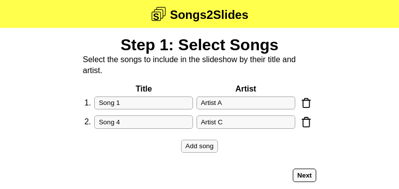
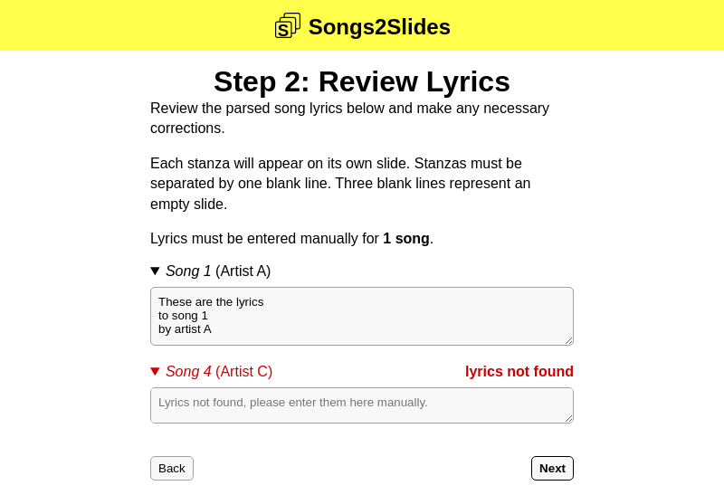
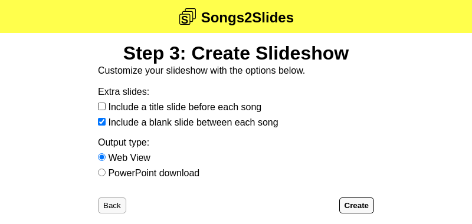
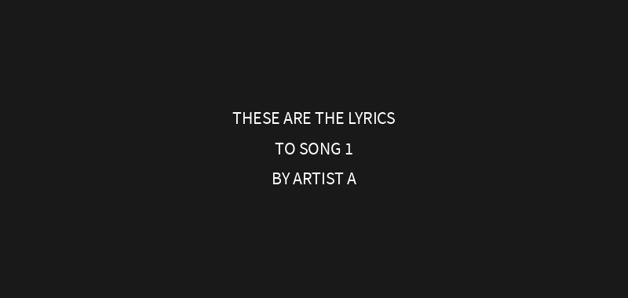

# Songs2Slides
A tool that automatically finds song lyrics and creates lyric slideshows

## Setup
Install Python dependencies:
```
python3 -m pip install -r requirements.txt
```

Add API environment variables to a `.env` file:
```
# Song lyric API with {title} and {artist} placeholders
API_URL="http://example.com/get-lyrics?title={title}&artist={artist}"

# Optional API authentication header
API_AUTH="Bearer secrettoken"
```

Run Songs2Slides on [localhost:5000](http://localhost:5000)
```
flask --app songs2slides run
```

## Screenshots
Screenshots of Songs2Slides with `mock_api.py` as the API:








